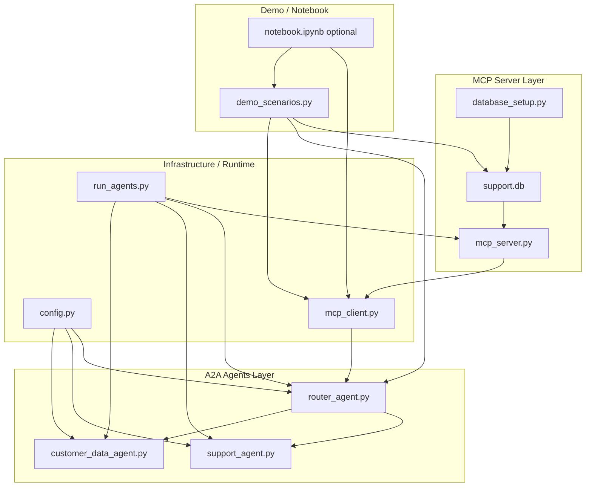

# 📦 Customer Support Multi-Agent System (A2A + MCP + SQLite)
This repository contains a fully-functional **multi-agent customer support system** that integrates:
- **Google ADK A2A (Agent-to-Agent)** orchestration  
- **MCP (Model Context Protocol) HTTP server**  
- **SQLite database** initialized using your professor's official `database_setup.py`  
- **Gemini 2.5 Pro / Gemini 1.5 Flash** models  
- **Uvicorn micro-services** for three AI agents

The system demonstrates a complete end-to-end **agentic workflow**, combining database-backed MCP tools with multi-agent LLM collaboration.

---

## 1. 🔧 System Overview
The application runs three cooperating AI agents:

### 1. Customer Data Agent  
Processes *only* the JSON returned from MCP.  
- Summarizes customer profiles  
- Extracts relevant attributes  
- Organizes ticket histories  
- Never directly queries the DB

### 2. Support Agent  
Handles real customer support actions:  
- Billing issues  
- Refunds  
- Cancellations  
- Upgrades  
- Escalations  

Uses transformed customer data + user query.

### 3. Router / Orchestrator Agent  
The "brain" of the entire workflow.  
- Analyzes the user query  
- Decides which MCP tools to call  
- Fetches real data via `tools/call`  
- Delegates to Customer Data + Support agents  
- Synthesizes final answers

---

## 🎯 What This Project Demonstrates
- **End-to-end MCP → A2A → LLM pipeline**  
- **Real database access** through the MCP Streamable HTTP protocol  
- **Clean separation of responsibilities** across agents  
- **Modular, production-inspired agent system design**  
- **A complete customer support simulation** using modern agent frameworks  

This repository is ideal for:
- Academic submissions (ADK + MCP coursework)  
- Multi-agent workflow demos  
- Prototyping customer-service automation  
- Research on agent orchestration with real tools  

---

## 2. 📊 Repository Structure & File Relationships
Below is a high-level diagram of how the main files in this repo connect to each other.


---

## 3. 🚀 End-to-End Setup & Usage Guide
This section walks you through **exactly how to run the entire multi-agent + MCP pipeline** from scratch, using this repository.  
Follow the steps carefully and you will get a fully working **MCP-backed multi-agent customer service system**.

---

### ✅ Step 1 — Clone the Repository
```bash
git clone https://github.com/TommyWangZL/MCP_A2A.git
cd customer-service-mcp
```

---

### ✅ Step 2 — Install All Dependencies

Install all required packages using:
```bash
pip install -r requirements.txt
```

This installs:
* `google-genai`
* `google-adk`
* `a2a-sdk`
* `mcp[cli]`
* `uvicorn`, `httpx`, `aiohttp`, `nest_asyncio`
* and all other required packages

---

### ✅ Step 3 — Set Environment Variables

Before running anything, configure your environment variables.

Create the environment configuration by copying:
```bash
cp .env.example .env
```

Then edit the `.env` file and fill in your values:
```bash
GOOGLE_API_KEY=YOUR_API_KEY_HERE
GOOGLE_CLOUD_PROJECT=gen-lang-client-0201328881
GOOGLE_CLOUD_LOCATION=us-central1
```

⚠️ **Your API key is never stored in the repository. It exists only locally in your `.env` file.**

---

### ✅ Step 4 — Initialize the SQLite Database

Your professor requires running `database_setup.py` first.

Run:
```bash
python database_setup.py
```

Then run the database bootstrap that inserts a premium customer and sample tickets:
```bash
python -c "from mcp_server import init_db_with_professor_script; init_db_with_professor_script()"
```

This creates the SQLite database file:
```
support.db
```

The database includes:
* customers
* tickets
* triggers
* sample data
* a sample premium customer (ID 12345)

---

# ✅ Step 5 — Start the MCP Server

This server exposes actual database tools (`get_customer`, `create_ticket`, etc.) using the MCP Streamable HTTP protocol.

Start the server:
```bash
python mcp_server.py
```

It becomes available at:
```
http://127.0.0.1:8000/mcp
```

**Keep this terminal window open.**

---

### ✅ Step 6 — Start the A2A Multi-Agent Servers

Open a new terminal window and run:
```bash
python run_agents.py
```

This launches three agents:
* **Customer Data Agent** — port 11020
* **Support Agent** — port 11021
* **Router Agent** — port 11022

These agents remain active and listen for incoming requests.

---

### ✅ Step 7 — Run End-to-End Scenarios (MCP + A2A)

Open a third terminal window and run:
```bash
python demo_scenarios.py
```

This script:
* sends test queries to the Router Agent
* the Router calls the Customer Data Agent
* the Customer Data Agent uses your MCP server for database lookups
* the Support Agent generates the final customer-service response

To run a specific scenario:
```bash
python demo_scenarios.py 0  # Simple: get customer information for ID 5
python demo_scenarios.py 1  # Coordinated: upgrade workflow
python demo_scenarios.py 3  # Escalation: double charges and refund
python demo_scenarios.py 7  # Multi-step premium customer support
```

---

### 🎉 Success!

You now have a fully functional multi-agent customer-service system powered by:
* **Gemini 2.5 Pro**
* **Google ADK**
* **A2A multi-agent orchestration**
* **MCP Streamable HTTP tools**
* **A real SQLite database (professor-approved)**
